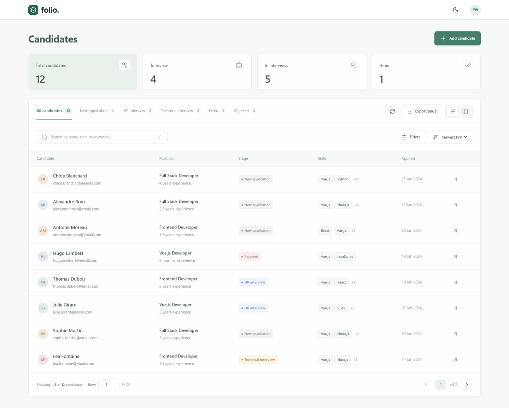
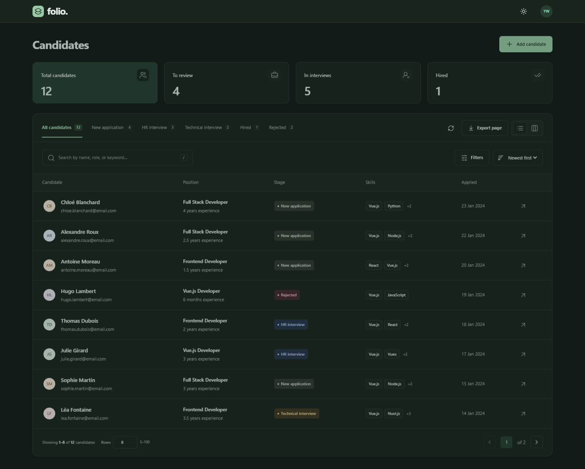
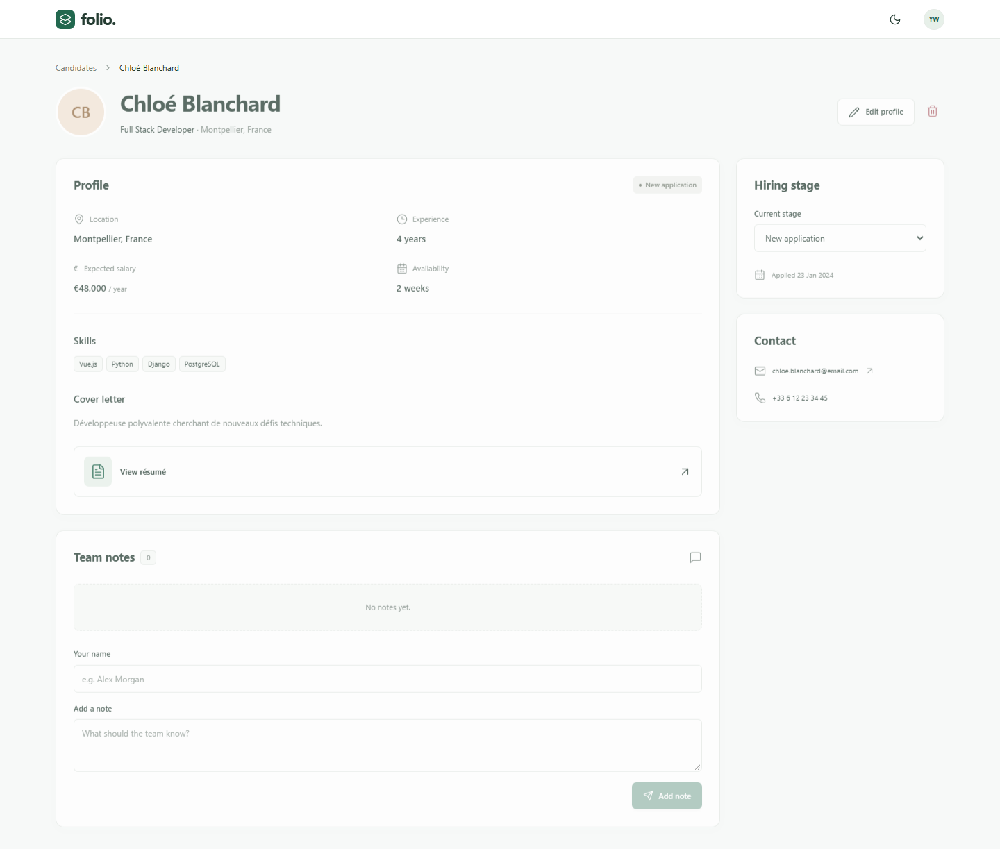
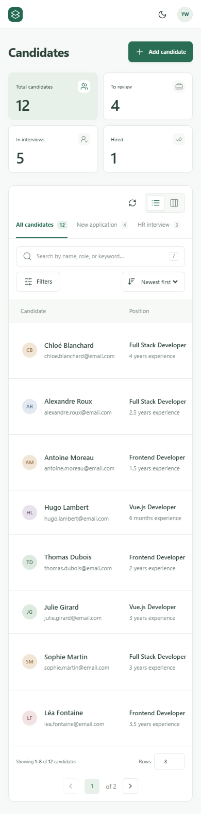

# Folio — Candidate Manager

A small Vue 3 + TypeScript recruitment app for the supplied junior/mid-level technical test. English interface, original French API data, a calm green palette, light/dark themes, and a feature-based architecture familiar to a React/Next.js developer.

## Run locally

Use Node.js 22.12+ (a current Node 22 LTS patch is recommended) and npm.

```sh
npm install
npm start
```

This starts both services:

- App: http://localhost:5173
- JSON Server: http://localhost:3000
- Check the API: http://localhost:3000/candidatures

Or use two terminals:

```sh
npm run api
```

```sh
npm run dev
```

**JSON Server is required.** Every candidate, status, position, and skill comes from HTTP requests to the provided `db.json`. The app does not import that database or fall back to hardcoded candidate data. Real application writes update `db.json` and persist across server restarts. Make a backup before experimenting if you want to retain the original data.

JSON Server is intentionally pinned to **0.17.4**, whose `q`, `_page`, `_limit`, `_sort`, `_order`, and `X-Total-Count` behavior matches the assignment. Do not blindly replace it with the 1.x API. See [its versioned documentation](https://github.com/typicode/json-server/tree/v0.17.4).

If port 3000 is occupied, start `npm run api -- --port 3001`, copy `.env.example` to `.env`, change `VITE_API_URL` to `http://localhost:3001`, and restart Vite. The services bind to the local computer. The API is a development server without authentication.

If Vite's port 5173 is occupied, run the services separately with `npm run api` and `npm run dev -- --port 5175`. The preview prepared during implementation uses http://127.0.0.1:5175 because another local app was already using 5173.

## Commands

| Command              | Purpose                                      |
| -------------------- | -------------------------------------------- |
| `npm start`          | App + JSON Server together                   |
| `npm run dev`        | Vite app only                                |
| `npm run api`        | JSON Server watching `db.json`               |
| `npm run build`      | Strict TypeScript check + production build   |
| `npm run preview`    | Preview production build; API must still run |
| `npm test`           | Unit and component tests                     |
| `npm run test:watch` | Watch tests during development               |
| `npm run test:e2e`   | Browser tests using installed Microsoft Edge |
| `npm run format`     | Format source and documentation              |

Browser tests start their own app on **5174** and API on **3002**. They copy `tests/fixtures/db.json` (the original sample data) into ignored `.test-data/db.json`, so your edits to the live database do not affect the tests. Test writes never modify your live database. On a computer without Edge, install Playwright Chromium with `npx playwright install chromium` and remove `channel: 'msedge'` from `playwright.config.ts`.

## Deployment

The Vue frontend can run on Netlify, but JSON Server must run as a separate web service. This repository includes `render.yaml` and a platform-aware API start script for Render:

1. In Render, create a Blueprint from this repository. It creates the `folio-candidate-api` Node web service.
2. Wait for the deploy, then verify `https://YOUR-SERVICE.onrender.com/candidatures` returns JSON.
3. In Netlify, open **Project configuration → Environment variables** and set `VITE_API_URL` to the Render service URL without a trailing slash. Make the variable available to builds.
4. Trigger a new Netlify production deploy, then verify the application in a private browser window with the local JSON Server stopped.

Render's free web service is sufficient for a technical-test demonstration, but it sleeps when idle and uses an ephemeral filesystem. Candidate changes can reset after a restart, spin-down, or redeploy. A paid persistent disk is required if hosted edits must survive those events.

## What's included

- Server-driven candidate list, combined filters, sorting, and pagination. Search and the custom 5–100 row limit share one reusable 300 ms debounce composable.
- Candidate detail loaded independently with `GET /candidatures/:id`.
- Create, read, edit, delete, change stage, and add named team notes.
- Zod-powered field validation for names, email, phone, dates, salary, URLs, experience, location, and controlled metadata values.
- List/board views, native drag and drop, and accessible stage selects for keyboard/touch use.
- Optimistic updates with failure rollback, per-candidate write locking, Sonner loading/success/error notifications, loaders, retry, empty states, and missing-record feedback.
- Compact header with a user avatar that hides on downward scrolling and returns on upward scrolling; nested pages show clickable breadcrumbs in the content area.
- Bounded 30-second page cache, 5-minute metadata cache, invalidation after writes, explicit refresh, cancellation and stale-response guards.
- Saved filters, preferred view, theme, and note author. Candidate data is not stored in localStorage.
- Responsive layout, reduced-motion support, semantic forms/tables, focus indicators, modal focus management, and English UI labels.
- Current-page CSV export, explicitly labeled so it does not imply a full export.

The board deliberately shows the **same paginated result set** as the table. Its help text and pagination make this explicit. Dashboard counts and stage tabs describe the whole pipeline; the list count describes the current filters.

## Structure

```text
src/
├── app/                     # Root shell, bootstrap, router, global styles
├── pages/                   # Thin route components
├── features/
│   └── candidates/
│       ├── components/      # Workspace, filters, table, board, detail, editor
│       ├── services/        # Typed Axios API and query builder
│       ├── stores/          # Pinia state, cache, mutations, preferences
│       ├── utils/           # English labels and candidate formatting
│       ├── validation/      # Zod schema and field-level validation
│       └── types.ts         # Original API schema
└── shared/
    ├── api/                 # Axios instance and general API error messages
    ├── components/          # Feedback state and confirmation dialog
    ├── composables/         # Reusable debounce lifecycle
    └── utils/               # Safe optional browser storage
```

Styling lives in **`src/app/styles.css`**: global design tokens, theme colors, component classes, and responsive rules. Tailwind v4 provides utilities used in templates through its [official Vite integration](https://tailwindcss.com/docs/installation/using-vite). There is no UI framework or generic repository/service abstraction.

## Screenshots

Generated from the running application by the browser tests.






## Technical notes and submission

- [UX analysis](docs/UX-ANALYSIS.md)
- [Architecture, API strategy, and tradeoffs](docs/TECHNICAL.md)
- [Completion report and remaining submission checklist](docs/IMPLEMENTATION-REPORT.md)
- [2–3 minute demo walkthrough](docs/DEMO.md)

## Time spent

The implementation took approximately **6 hours** for an experienced React/Next.js frontend developer becoming familiar with Vue 3. The phase-by-phase breakdown is recorded in the [completion report](docs/IMPLEMENTATION-REPORT.md#time-log).

## Improvements with more time

Use a real backend with authentication, authorization, input validation, independent comment records, and conflict detection. Add per-column board pagination for larger pipelines, richer candidate activity history, URL-synced shareable filters, and normalized numeric experience fields. Run a broader accessibility and cross-browser audit before production. The provided résumé URLs are example.com placeholders; opening one does not imply a real PDF exists.
