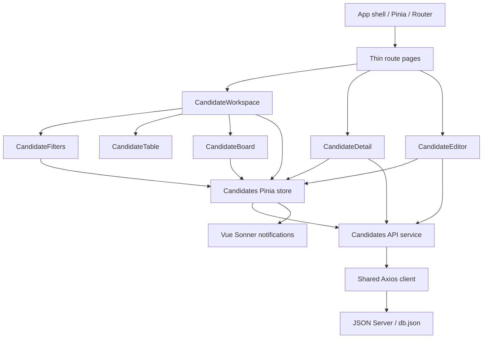

# Technical design

## Component and data flow

Each page translates route parameters and composes one feature component. Candidate types, queries, cache, state, forms, display mappings, and business actions stay in `features/candidates`. Shared contains only components and utilities that make sense outside recruiting.

## API strategy

The Axios instance defines one configurable base URL and a 10-second timeout. The feature service owns resource paths and typed payloads:

| Interaction              | Request                                                                                                                                                |
| ------------------------ | ------------------------------------------------------------------------------------------------------------------------------------------------------ |
| List/search/filter/sort  | `GET /candidatures?q=…&statut=…&poste=…&competences_like=…&dateCandidature_gte=…&dateCandidature_lte=…&experience=…&_sort=…&_order=…&_page=…&_limit=…` |
| Full profile             | `GET /candidatures/:id`                                                                                                                                |
| Create                   | `POST /candidatures`                                                                                                                                   |
| Edit, stage, or comments | `PATCH /candidatures/:id`                                                                                                                              |
| Delete                   | `DELETE /candidatures/:id`                                                                                                                             |
| Metadata                 | `GET /statuts`, `/postes`, `/competences`                                                                                                              |
| Global stage counts      | One `_page=1&_limit=1&statut=…` request per status, reading `X-Total-Count`                                                                            |

Unused filter parameters are omitted. Skill regex characters are escaped and boundaries match whole array entries, preventing `Vue.js` from matching arbitrary characters. ISO date filters include the entire end day. Each filter change resets to page one. Search, filters, and pagination run on JSON Server, not on a preloaded dataset. Detail pages always request their record, supporting direct links and fresh reads.

The supplied database nests comments inside each candidate. Appending comments therefore uses `PATCH` with the updated array, not `_embed=commentaires`, which would require a separate resource. Profile edits omit the comments field so they cannot replace notes posted while a form was open.

## State, synchronization, and performance

- Pinia owns list data, totals, metadata, filters, preferred view, and mutation states. Detail/form state stays close to its owning screen.
- The shared `useDebouncedCallback` composable limits both search and page-size requests to one update after 300 ms. Axios receives `AbortSignal`; a request sequence also prevents older responses from replacing newer results.
- Query results are cached for 30 seconds with at most 20 entries. Metadata is cached for five minutes. Explicit refresh bypasses both caches.
- A write invalidates query data and reloads current results and summary counts. An empty last page moves back to the last available page.
- Patches apply immediately and snapshot the record for rollback. A per-ID pending set prevents duplicate writes on that candidate. Failures restore local state and show a persistent dismissible error notification.
- Creates and deletes are server-confirmed. Successful deletion clears cached results and immediately returns to the list, which then refreshes independently. Failed deletion keeps the profile open and displays a Sonner error.
- Metadata requests are parallel. Summary counts fetch only one record per stage instead of downloading all candidates.
- Route components are lazy loaded. Utility icons are individually imported. Cache is memory-only; candidate records do not go into localStorage.
- Browser storage is optional and guarded against unavailable storage and malformed JSON. Saved filter values are type-checked.

JSON Server has no ETags, transactions, or event stream. Re-reading comments before appending reduces stale updates but cannot guarantee safety against simultaneous writers. A production backend should expose independent comments and versioned conditional writes. Refresh gives the user a manual way to reconcile external changes.

## Styling and accessibility

Global CSS variables define surfaces, borders, text, and accent colors. The root `data-theme` attribute switches the palette and native form color scheme. An early theme script avoids a bright flash for users who prefer dark mode. Tailwind utilities support layout/spacing without hiding the theme in scattered classes.

Semantic buttons, anchors, labels, table headers/caption, notification roles, loading states, a skip link, and visible focus support basic accessibility. The delete dialog uses native `showModal()` focus containment, Escape cancellation, initial focus on Cancel, and focus restoration. Board cards offer ordinary selects for non-pointer input. Animations honor reduced motion.

## Decisions and issues resolved

1. **Version mismatch in the assignment:** current JSON Server interfaces differ from the test's parameter conventions. Pinning 0.17.4 preserves the exact API contract.
2. **French data / English UI:** display mapping translates known labels without changing stored values or breaking filters.
3. **Nested comment writes:** retain the supplied schema, fetch current notes before appending, and document last-write-wins limitations.
4. **Board scale:** retain server pagination and explicitly label its current-page scope. A full large-scale kanban requires per-column paging.
5. **Windows validation restrictions:** build tools and browser processes needed permission outside the workspace sandbox; the project commands themselves remain conventional npm scripts.
6. **Test isolation:** browser tests start separate ports and a fresh database copy, allowing full CRUD verification without altering the deliverable data.

## React / Next.js to Vue map

| Familiar concept                | This Vue app                                                      |
| ------------------------------- | ----------------------------------------------------------------- |
| Function component              | `.vue` single-file component with `<script setup>` + `<template>` |
| `useState`                      | `ref()` for values, `reactive()` for form objects                 |
| Derived render data / `useMemo` | `computed()`                                                      |
| Effect / cleanup                | `watch`, `onMounted`, `onUnmounted`                               |
| Props / callbacks               | `defineProps` / typed `defineEmits`                               |
| Controlled input                | `v-model`                                                         |
| Zustand/Redux store             | Pinia setup store                                                 |
| Route component                 | Thin `pages` component, configured in Vue Router                  |
| Conditional JSX / array map     | `v-if` / `v-for` with stable keys                                 |

Refs use `.value` in TypeScript and unwrap automatically in templates. Pinia stores unwrap refs too; if destructuring reactive store properties, use `storeToRefs`. The implementation deliberately uses direct `store.property` access to avoid that footgun.

## Future scaling / interview talking points

For 10,000 candidates, keep search/filter/paging on an indexed backend, add per-column board cursors, and virtualize only views that actually render many rows. For real-time collaboration, use server-sent events or WebSockets to invalidate affected records plus version checks for edits. Cache reference data longer than candidate searches. Test business behavior with mocked services and confirm the actual request contract with an isolated JSON Server integration suite. Prioritize keyboard operation, accessible names, focus continuity, and contrast in an accessibility review.
